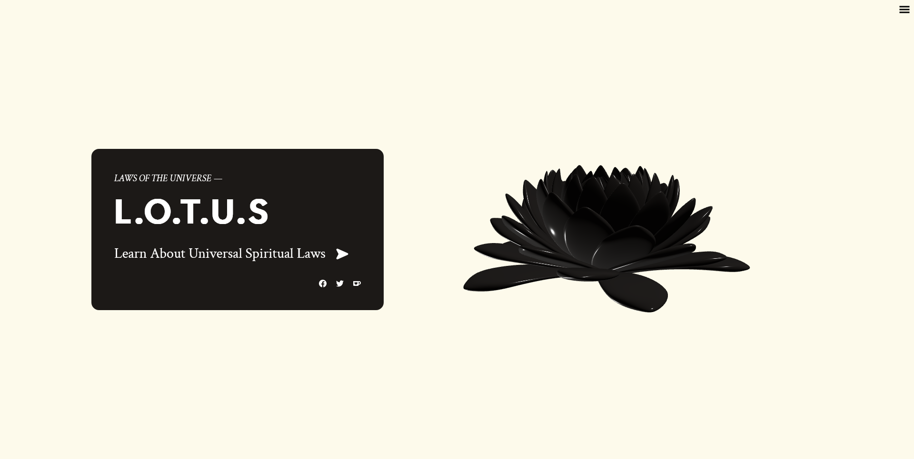

# Laws of the Universe

This project is an eye-catching resource for learning about the Spiritual Laws of the Universe, referencing esoteric text like the Kybalion.

## Credits

### Fonts

- Cal Sans: Sans
- Crimson: Serif
- Ubuntu Mono: Monospace

### Icons

- Game Icons: Creative Commons by 3.0 License
- Simple Icons: Creative Commons 0 - 1.0 Universal License
- Solar Icons: Creative Commons by 4.0 License

### 3D Assets

["Lotus Flower by Geometry Nodes"](https://skfb.ly/o9nSz) by Shiki is licensed under [Creative Commons Attribution-NonCommercial](http://creativecommons.org/licenses/by-nc/4.0/).
